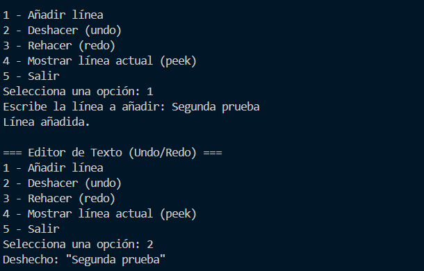
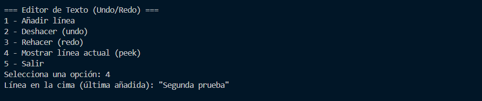

# Editor de Texto con Undo/Redo en Java

## OBJETIVO DEL PROYECTO
Desarrollar un editor de texto sencillo en consola utilizando el lenguaje Java, que permita al usuario escribir líneas de texto, deshacer (Undo) y rehacer (Redo) acciones mediante pilas implementadas manualmente, con el fin de comprender su estructura y funcionamiento.  
Además, fomentar el trabajo colaborativo mediante el uso de GitHub para el control de versiones y la participación activa de todos los integrantes del equipo.

---

## DEMOSTRACIÓN DEL FUNCIONAMIENTO

Al ejecutar el proyecto se muestra un menú en consola:

En este menú escogemos la acción que queremos realizar.

---

### 1. Añadir texto
Escogemos la opción 1 e ingresamos la línea `"Primera prueba"`.

Luego ingresamos otra línea `"Segunda prueba"`.

---

### 2. Deshacer (Undo)
Al entrar en la opción 2, se deshace la última línea (`"Segunda prueba"`) y pasa a la pila de rehacer.

---

### 3. Rehacer (Redo)
Al entrar en la opción 3, se rehace el texto de la pila de rehacer y vuelve a la pila principal (`"Segunda prueba"`).

---

### 4. Mostrar línea actual (Peek)
Con la opción 4 se muestra el texto en la cima de la pila, es decir, el último ingresado.

---

### 5. Validación de opción inválida
Si se ingresa un valor distinto a los del menú, aparece el mensaje de error y vuelve a mostrarse el menú.

---

### 6. Salir
Por último, en la opción 5 se finaliza el programa con un mensaje de despedida.

